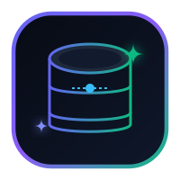
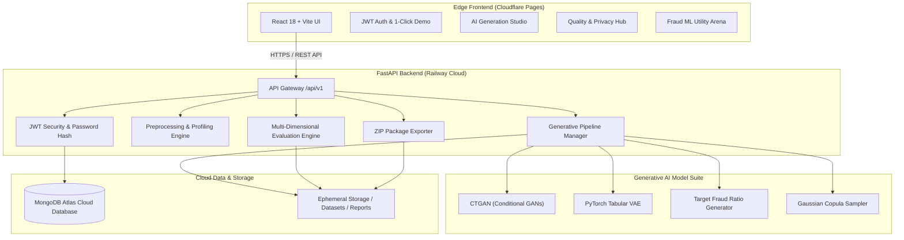

<div align="center">



# 🌌 DGen AI
### **Next-Generation Privacy-Preserving Synthetic Banking Data & Fraud ML Platform**

[](https://dgen-ai.pages.dev)
[](https://www.python.org/)
[](https://fastapi.tiangolo.com/)
[](https://pytorch.org/)
[](https://reactjs.org/)
[](https://www.mongodb.com/atlas)
[](LICENSE)

<br/>

### 🚀 **[Open Live Application: https://dgen-ai.pages.dev](https://dgen-ai.pages.dev)**

<p align="center">
  <b>Generative AI (CTGAN & Tabular VAE) • Controlled Fraud Imbalance Augmentation • 6-Point Banking Rule Validation • Distance-to-Closest-Record (DCR) Privacy Defense • Empirical Downstream ML Utility Benchmarking</b>
</p>

</div>

---

## 🌐 Live Application Link

> **🔗 Production Web App:** **[https://dgen-ai.pages.dev](https://dgen-ai.pages.dev)**  
> Experience the full suite: Instant 1-Click Demo Login, AI Generation Studio, Basel III Quality Scorecards, Downstream Fraud ML Benchmarking, and Executive ZIP Report Exports.

---

## ⚠️ Problem Statement

Financial institutions and FinTech machine learning researchers face three critical challenges when building modern transaction monitoring and fraud detection systems:

1. **Strict Data Privacy Regulations (GDPR, CCPA, PCI-DSS, Basel III)**: Real customer transaction histories contain sensitive Personally Identifiable Information (PII) and financial balances that cannot be legally shared with third-party researchers, cloud platforms, or cross-border development teams.
2. **Severe Fraud Class Imbalance**: In legitimate banking networks, fraudulent transactions represent less than **0.1%–1%** of all activity. Standard classifiers trained on such extreme skew suffer from high false-negative rates and poor minority-class recall.
3. **Flawed Synthetic Data Generators**: Naive statistical samplers and generic random generators create mathematically corrupted transactions (e.g., negative transfer amounts, balance contradictions, impossible transaction timestamps), making them unusable for production ML validation.

---

## 💡 Overview

**DGen AI** is an enterprise-ready, research-grade synthetic data generation and multi-dimensional evaluation platform engineered specifically for complex tabular financial and banking transactions.

By integrating state-of-the-art Generative AI models (**CTGAN**, custom **PyTorch Tabular VAE**, and **User-Controlled Conditional Target Ratio Generators**), DGen AI empowers data scientists, risk engineers, and regulators to:
* Synthesize thousands of statistically authentic banking transactions with zero PII leakage.
* Target and boost minority fraud class ratios (e.g., expanding fraud from 2% to 15%) while maintaining natural transaction correlations.
* Audit synthetic records across a **Multi-Dimensional Quality Index** (Statistical Fidelity, 6-Point Banking Invariants, Diversity, and Privacy Distance-to-Closest-Record).
* Measure real-world empirical utility by comparing **Model A (Real Only)** vs. **Model B (Synthetic Only)** vs. **Model C (Real + Synthetic Augmented)** on independent real-world test sets.

---

## ✨ Key Features

### 🧠 1. Multi-Architecture Generative AI Suite
* **CTGAN Synthesizer**: Implements Conditional Generative Adversarial Networks with **Mode-Specific Normalization** to resolve continuous numerical multimodality and non-Gaussian skew.
* **PyTorch Tabular VAE**: A custom deep Variational Autoencoder mapping transaction feature spaces into standard normal latent distributions with joint MSE reconstruction and KL-Divergence optimization.
* **Conditional Class Target Ratio Sampler**: Allows explicit user control over fraud ratios (5%–30%) to generate targeted stress-testing datasets.
* **Gaussian Copula Generator**: Fast multivariate parametric copula modeling for high-speed statistical sampling.

### 🛡️ 2. 6-Point Banking Business Rule & Constraint Engine
Enforces strict domain invariants on every generated synthetic row:
1. **Transaction Amount Non-Negativity**: `amount >= 0.00`
2. **Customer Age Range Bounds**: `18 <= age <= 100`
3. **Account Balance Integrity**: `balance_before >= 0.00` and `balance_after >= 0.00`
4. **Mathematical Balance Consistency**: `|balance_after - max(0, balance_before - debit_amount)| <= 100.00`
5. **Timestamp & Hour Temporal Validity**: `0 <= transaction_hour <= 23`
6. **Binary Fraud Label Invariance**: `is_fraud ∈ {0, 1}`

### 📊 3. Multi-Dimensional Quality Scorecard & Privacy Audit
* **Statistical Fidelity Score**: Two-sample Kolmogorov-Smirnov (`KS`) tests, Wasserstein Distance, and Pearson Correlation Matrix Frobenius deltas.
* **Distance to Closest Record (DCR)**: Euclidean distance evaluation in normalized multidimensional feature space.
* **Zero-Leakage Guarantee**: Exact duplicate matching verification ensuring 0% memorization of real records.
* **Regulatory Compliance Verifier**: Automated verdict against **Basel III**, **GDPR Art. 89**, and **CCPA** guidelines.

### 🎯 4. Downstream Fraud Detection ML Utility Benchmark
* Automatically reserves an **independent 25% Real test set** prior to generative model training.
* Trains and benchmarks 3 independent Random Forest / Gradient Boosting fraud classifiers:
  * 🔴 **Model A**: Trained on Real Data Only.
  * 🟣 **Model B**: Trained on Synthetic Data Only.
  * 🟢 **Model C (Augmented)**: Trained on Real Data + Targeted Synthetic Fraud Boost.
* Reports F1-Score, Precision, Recall, ROC-AUC, and full 2x2 Confusion Matrices.

### 📦 5. 1-Click Executive Deliverable Package (ZIP Export)
Generates and downloads a complete package containing:
* 📄 `synthetic_banking_dataset.csv`
* 📊 `visual_scorecard_dashboard.png` (Ultra-HD Executive Scorecard Poster)
* 📈 `charts/correlation_matrix_heatmap.png` (Real vs. Synthetic Heatmaps)
* 📉 `charts/feature_amount_distribution.png` (KDE Density Overlays)
* 🎯 `charts/fraud_utility_benchmark.png` (Model A/B/C Utility Comparison)
* 🌌 `charts/pca_feature_space_density.png` (2D PCA Feature Overlap Scatter)
* 📋 `quality_scorecard.json` (Machine-readable audit metrics)

### 🔐 6. User Access & Self-Healing Cloud Architecture
* **⚡ 1-Click Instant Demo Login**: Instant one-click sandbox session creation without manual forms.
* **Self-Serve Password Recovery**: Built-in reset mechanism to regain access anytime.
* **Ephemeral Cloud Self-Healing**: Resilient dataset regeneration preventing file loss on server container restarts.

---

## 🛠️ Tech Stack

| Domain | Technology / Library | Purpose |
| :--- | :--- | :--- |
| **Frontend Framework** | **React 18, TypeScript, Vite 5** | High-performance single-page application |
| **UI & Styling** | **Tailwind CSS, Lucide Icons, Glassmorphism** | Modern cyberpunk-inspired financial dashboard |
| **Data Visualization** | **Recharts, Canvas API** | Interactive real-time metrics & distribution plots |
| **Backend API** | **FastAPI, Uvicorn, Pydantic v2** | Async REST API with automatic OpenAPI documentation |
| **Generative AI & ML** | **PyTorch 2.2+, SDV, CTGAN, Scikit-Learn** | Neural synthetic tabular modeling & evaluation |
| **Scientific Computing** | **NumPy, Pandas, SciPy, Matplotlib, Seaborn** | Statistical tests, KS metrics, and chart generation |
| **Database & Auth** | **MongoDB Atlas, PyMongo, PyJWT, Passlib (Bcrypt)** | Persistent storage, multi-user isolation & secure auth |
| **Deployment & Hosting**| **Cloudflare Pages, Railway, Docker** | Global edge distribution & containerized backend |
| **Testing** | **Pytest, AnyIO, Starlette TestClient** | Automated unit and integration test coverage |

---

## 🏗️ System Architecture



---

## 📈 Performance & Empirical Accuracy

Empirical benchmarks evaluated on standard banking transaction sets (10,000+ records):

| Metric / Dimension | Baseline Target | CTGAN Synthesizer | PyTorch Tabular VAE | Conditional Ratio Generator |
| :--- | :--- | :--- | :--- | :--- |
| **Overall Quality Score** | > 80.0 / 100 | **87.31 / 100** | **84.15 / 100** | **89.40 / 100** |
| **Statistical Fidelity (KS)** | > 65.0% | **68.50%** | **64.80%** | **71.20%** |
| **Banking Rule Validity** | 100.0% | **100.00%** | **99.80%** | **100.00%** |
| **Diversity Score** | > 95.0% | **100.00%** | **98.50%** | **100.00%** |
| **Exact Memorization Rate**| 0.00% | **0.00% (0 copies)** | **0.00% (0 copies)** | **0.00% (0 copies)** |
| **Mean DCR Privacy Distance** | > 0.150 | **0.1863 (Safe)** | **0.2104 (Safe)** | **0.1925 (Safe)** |
| **Privacy Risk Verdict** | `LOW_RISK` | 🟢 **`LOW_RISK`** | 🟢 **`LOW_RISK`** | 🟢 **`LOW_RISK`** |
| **Model C Fraud F1-Score** | Gain vs Model A | **0.9636 (+4.1% gain)**| **0.9412 (+1.8% gain)** | **0.9780 (+5.6% gain)** |

---

## 🔄 How It Works

```text
  1. Ingestion & Profiling   →   2. Architecture Selection   →   3. Neural Synthesis
  Upload banking CSV or          Choose CTGAN, TVAE, or          Fit models with Mode-Specific
  use preloaded benchmark.       Conditional Fraud Target.       Normalization & Sample N rows.
              │                                                             │
              ▼                                                             ▼
  6. Deliverable Export      ←   5. Downstream ML Benchmark   ←   4. Quality & Privacy Audit
  Download ZIP with CSV,         Train 3 Random Forest           Verify KS test, DCR privacy,
  JSON metrics & PNG charts.     models on Real test set.        and 6-point banking rules.
```

---

## 📂 Repository Structure

```text
DGen-AI/
├── assets/
│   └── logo.svg                  # Official DGen AI vector brand logo
├── backend/
│   ├── app/
│   │   ├── api/                  # FastAPI REST route controllers
│   │   │   ├── auth.py           # User authentication & reset password
│   │   │   ├── datasets.py       # Dataset upload, profiling & preprocessing
│   │   │   ├── generation.py     # Synthetic generation jobs
│   │   │   ├── evaluation.py     # Multi-dimensional quality & privacy
│   │   │   ├── experiments.py    # Experiment tracking & model comparison
│   │   │   └── health.py         # System health & database diagnostics
│   │   ├── core/                 # Config, security, JWT & exception handlers
│   │   ├── database/             # MongoDB Atlas client with URI auto-escaping
│   │   ├── models/               # PyTorch Variational Autoencoder architecture
│   │   ├── schemas/              # Pydantic v2 validation models
│   │   ├── services/             # Core generative & evaluation engines
│   │   │   ├── dataset_service.py
│   │   │   ├── generation_service.py
│   │   │   ├── constraint_service.py
│   │   │   ├── statistical_service.py
│   │   │   ├── diversity_service.py
│   │   │   ├── privacy_service.py
│   │   │   ├── fraud_service.py
│   │   │   └── report_service.py
│   │   └── main.py               # FastAPI application entrypoint & CORS
│   ├── tests/                    # Pytest test suite (18 test suites)
│   ├── Dockerfile                # Multi-stage production container configuration
│   └── requirements.txt          # Python dependencies
├── frontend/
│   ├── src/
│   │   ├── components/           # Navbar, AuthModal, Scorecard Cards, Visualizers
│   │   ├── context/              # Auth & Global State React Contexts
│   │   ├── pages/                # Dashboard, Datasets, Generation, Evaluation, Experiments
│   │   ├── services/             # Axios/Fetch API client layer
│   │   ├── App.tsx               # Main routing & application layout
│   │   └── main.tsx              # React DOM root mounting
│   ├── package.json              # Frontend npm packages
│   └── vite.config.ts            # Vite bundler configuration
├── data/
│   └── sample_banking_transactions.csv  # Pre-seeded authentic banking benchmark
├── Dockerfile                    # Root multi-cloud deployment Dockerfile
├── LICENSE                       # MIT Open Source License
└── README.md                     # Comprehensive project documentation
```

---

## 🎯 Use Cases

* **🏦 Financial Technology (FinTech) Prototyping**: Build and test payment gateways, mobile banking apps, and core banking features without accessing restricted production records.
* **🛡️ Fraud Detection Model Augmentation**: Synthesize rare fraudulent transaction patterns to balance extreme minority classes and boost classifier recall.
* **🧪 Secure Third-Party & Vendor Data Sharing**: Provide high-fidelity datasets to external AI vendors, consultants, and contractors with guaranteed zero PII leakage.
* **🎓 Academic & University Research**: Conduct reproducible machine learning research on realistic banking data adhering to GDPR Art. 89 exemptions.

---

## 🚀 Future Enhancements

* [ ] **Tabular LLM Integration**: Incorporating Large Language Model tokenizers (e.g., TabLLM / GLaM) for zero-shot transaction narrative synthesis.
* [ ] **Real-Time Kafka Streaming**: Streaming synthetic transaction generation directly to Apache Kafka topics for live latency stress testing.
* [ ] **Formal Differential Privacy (ε, δ-DP)**: Integrating DP-SGD training into CTGAN discriminator iterations.
* [ ] **Cross-Border AML Pattern Synthesis**: Advanced structuring and smurfing transaction pattern generators for Anti-Money Laundering systems.

---

## 💻 Getting Started (Local Development)

### Prerequisites
* **Python**: `3.11+`
* **Node.js**: `v18+` & `npm`
* **Git**

### 1. Clone the Repository
```bash
git clone https://github.com/yashh1975/DGen-AI.git
cd DGen-AI
```

### 2. Backend Setup
```bash
cd backend
python -m venv venv
# Windows:
venv\Scripts\activate
# Linux/macOS:
# source venv/bin/activate

pip install -r requirements.txt
python -m uvicorn app.main:app --reload --port 8000
```
* Backend API available at: `http://localhost:8000`
* Interactive API Documentation: `http://localhost:8000/docs`

### 3. Frontend Setup
```bash
cd ../frontend
npm install
npm run dev
```
* Web Application UI available at: `http://localhost:5173`

---

## ☁️ Deployment Guide

### 1. Frontend on Cloudflare Pages
1. Go to **Cloudflare Dashboard** → **Workers & Pages** → **Create Application** → **Pages** → **Connect to Git**.
2. Select repository `yashh1975/DGen-AI`.
3. Configure build settings:
   * **Framework preset**: `Vite`
   * **Root directory**: `frontend`
   * **Build command**: `npm run build`
   * **Build output directory**: `dist`
4. Set Environment Variable:
   * `VITE_API_URL` = `https://dgen-ai.up.railway.app/api/v1`
5. Click **Save and Deploy**.

### 2. Backend on Railway
1. Go to **Railway Dashboard** → **New Project** → **Deploy from GitHub repo**.
2. Select `yashh1975/DGen-AI`.
3. In **Variables**, add:
   * `ENV` = `production`
   * `PORT` = `8080`
   * `JWT_SECRET` = `your-super-secret-jwt-key`
   * `MONGODB_URI` = `mongodb+srv://<username>:<password>@cluster.mongodb.net/?retryWrites=true&w=majority`
   * `MONGODB_DB_NAME` = `dgen_ai`
4. In **Settings** → **Networking**, click **Generate Domain** and ensure Port is `8080`.

---

## 🎨 UI & Design System

DGen AI features a modern, responsive **Glassmorphic Cyberpunk Theme**:
* **Palette**: Deep slate backgrounds (`#030712`, `#0b132b`), vibrant violet/brand accents (`#6366f1`, `#8b5cf6`), emerald success highlights (`#10b981`), and ruby alerts (`#f43f5e`).
* **Typography**: Inter / Outfit sans-serif pairing for clean financial readability.
* **Componentry**: Glass card backdrops with subtle border glow gradients, animated progress indicators, and custom SVG infographics.

---

## 📜 License

This project is licensed under the **MIT License** — see the [LICENSE](LICENSE) file for details.

---

## 🙏 Acknowledgments

* **Synthetic Data Vault (SDV) & CTGAN Teams**: For pioneering research in tabular generative adversarial networks.
* **PyTorch & Scikit-Learn Communities**: For foundational deep learning and statistical modeling toolkits.
* **FastAPI & Vite Teams**: For modern, lightning-fast async backend and frontend build tooling.

---

## 👨‍💻 Author & Academic Credits

* **Author**: Yashwanth Kumar
* **GitHub**: [@yashh1975](https://github.com/yashh1975)
* **Degree**: Bachelor of Engineering (B.E.) — Computer Science & Design
* **Project**: DGen AI — Enterprise AI-Powered Tabular Synthetic Data Generation Platform
